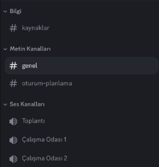
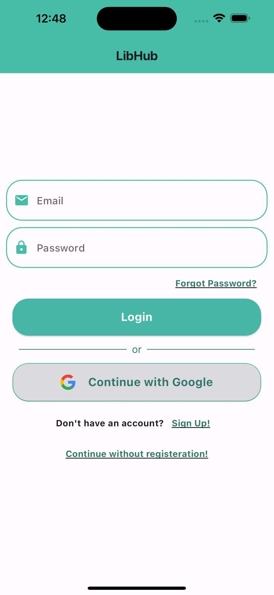
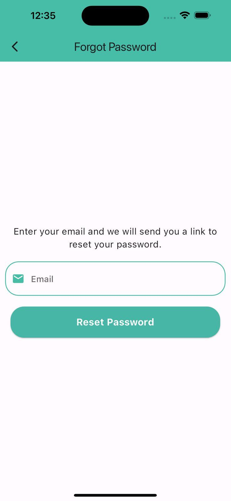
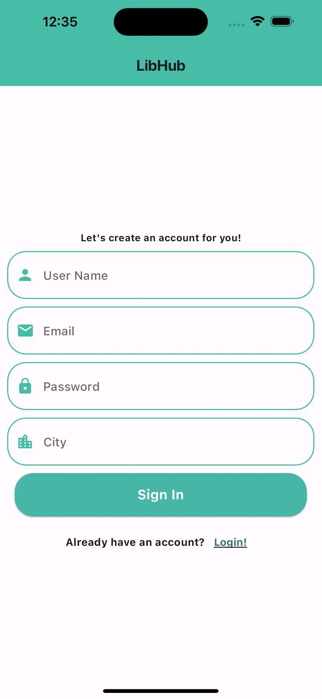
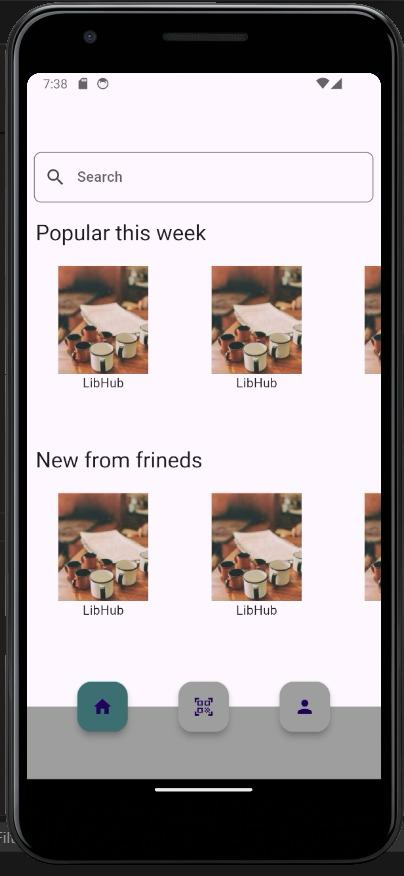
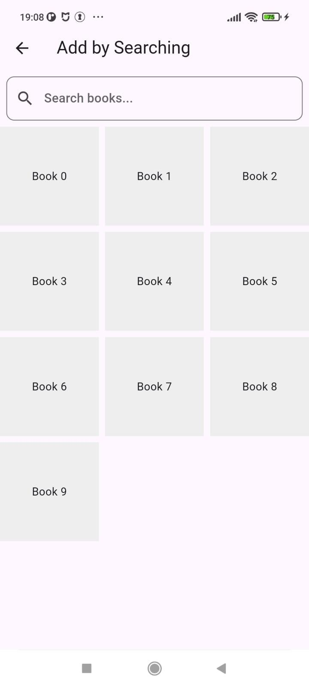
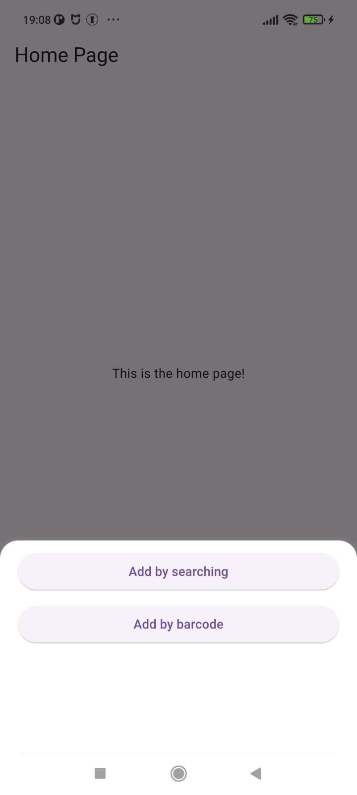
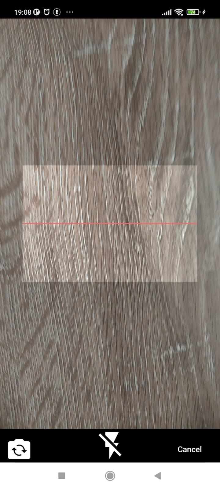
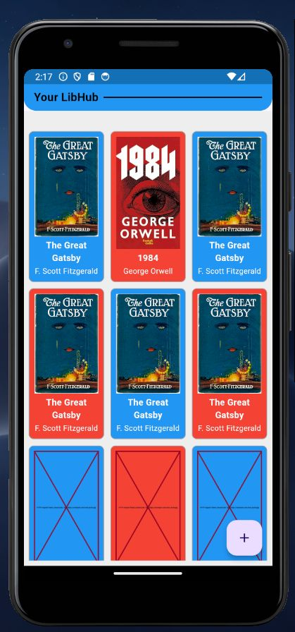

  <html>
  <body>

  

  
  # **Product Name**

  ### **`LibHub`**

  # Takım ve Ürün hakkında

  ## Team Members

  <table>
    <tr>
      <th></th>
      <th>Name</th>
      <th>Title</th>
      <th>Socials</th>
    </tr>
    <tr>
      <td></td>
      <td>Talib Yeşildal</td>
      <td>Scrum Master</td>
      <td>
        
        
        
      </td>
    </tr>
    <tr>
      <td></td>
      <td>Sena Ektiricioğlu</td>
      <td>Product Owner</td>
      <td>
        
        
        
      </td>
    </tr>
    <tr>
      <td></td>
      <td>Talha Taşhan</td>
      <td>Developer</td>
      <td>
        
        
        
      </td>
    </tr>
    <tr>
      <td></td>
      <td>Sevde Nur Ağba</td>
      <td>Developer</td>
      <td>
        
        
        
      </td>
    </tr>
    <tr>
      <td></td>
      <td>Sümeyye Erginöz</td>
      <td>Developer</td>
      <td>
        
        
        
      </td>
    </tr>

  ## Ürün Açıklaması

- LibHub ile okuduğunuz kitapları biriktirebileceğiniz bir kütüphaneye sahip olabilirsiniz. Kütüphanelerinizi arkadaşlarınız ile paylaşabilir ve en sevdiğiiniz kitap hakkında yorumları inceleyebilirsiniz. Ayrıca arkadaşınızın veya merak ettiğiniz bir kişinin bu kitabı nasıl bir rutinle ne kadar sürede bitirdiğini de görebilirsiniz!

## Ürün Özellikleri

- Kendi kütüphaneni oluşturma
- Kitapların kapağı, yazarı, konusu ve okuyan insanların düşüncelerini görebilme
- Yapay zeka asistanımız sayesinde aradığınız kitabı bulma
- Arkdaşların kütüphanesini görme
- Çevrendeki insanlarla kitap takası yapma

## Hedef Kitle

- Kitap okuyucuları
- 15 - 65 yaş arası kullanıcılar

## Kanban

[Trello](readmeassets/sprint1/kanban1.png)

---

# Sprint 1

- **Sprint Notları**: User Story'ler product backlog hazırlandı.

- **Backlog düzeni ve Story seçimleri**: Backlog'umuz ilk yapılacak story'lere göre düzenlenmiştir.

Story'ler yapılacak işlere (task'lere) bölünmüştür. Tasklar kendi içinde optional ve must şeklinde kontrol listeleriyle hazırlandı. Trello görüntüleri aşağıda paylaşıldı.

- **Daily Scrum**: Daily Scrum toplantılarının Discord üzerinden yapılmasına karar verilmiştir. Discord düzeni bu şekildedir:  

- **Ürün Durumu**: Ekran görüntüleri:
  
  
  
  
  
  
  
  

- **Sprint Review**: 
Alınan kararlar: Katmanlı mimari çerçevesinde çalışılacaktır. Veritabanı oluşturması kullanıcı verileri ve kitap bilgileri için gerekli görülmüştür, bir sonraki sprint için planlandı. İlk sprint için gerekli görülen tasklar tamamlanmıştır, birbirleriyle bağlanabilir olmaları testi başarılı olmuştur fakat bağlantı işlemleri önümüzdeki sprinte planlanmıştır. Temel sayfalar ve fonksiyonlar oluşturulmuştur fakat elde edilen görüntü birbiriyle uyumlu hale getirilecektir.

- **Sprint Retrospective:**
  - Takımın toplantı planlamaları gözden geçirilmeli katılım artmalı ve çakışmalar engellenmelidir.

-**Diğer Notlar**:
- N/A

  </body>
  </html>