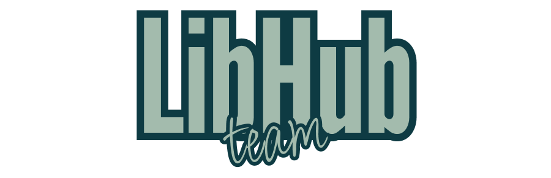

<!DOCTYPE html>
<html lang="tr">
<head>
    <meta charset="UTF-8">
    <meta name="viewport" content="width=device-width, initial-scale=1.0">
</head>
<body>

<h1>Product Name</h1>
<h3><code>LibHub</code></h3>

<h1>Takım ve Ürün hakkında</h1>
<h2>Team Members</h2>

<table>
    <tr>
        <th></th>
        <th>Name</th>
        <th>Title</th>
        <th>Socials</th>
    </tr>
    <tr>
        <td></td>
        <td>Talib Yeşildal</td>
        <td>Scrum Master</td>
        <td>
            
            
            
        </td>
    </tr>
    <tr>
        <td></td>
        <td>Sena Ektiricioğlu</td>
        <td>Product Owner</td>
        <td>
            
            
            
        </td>
    </tr>
    <tr>
        <td></td>
        <td>Talha Taşhan</td>
        <td>Developer</td>
        <td>
            
            
            
        </td>
    </tr>
    <tr>
        <td></td>
        <td>Sevde Nur Ağba</td>
        <td>Developer</td>
        <td>
            
            
        </td>
    </tr>
    <tr>
        <td></td>
        <td>Sümeyye Erginöz</td>
        <td>Developer</td>
        <td>
            
            
            
        </td>
    </tr>
</table>

<h2>Ürün Açıklaması</h2>

LibHub ile okuduğunuz kitapları biriktirebileceğiniz bir kütüphaneye sahip olabilirsiniz. Kütüphanelerinizi arkadaşlarınız ile paylaşabilir ve en sevdiğiniz kitap hakkında yorumları inceleyebilirsiniz. Ayrıca arkadaşınızın veya merak ettiğiniz bir kişinin bu kitabı nasıl bir rutinle ne kadar sürede bitirdiğini de görebilirsiniz!

<h2>Ürün Özellikleri</h2>
<ul>
    <li>Kendi kütüphaneni oluşturma</li>
    <li>Kitapların kapağı, yazarı, konusu ve okuyan insanların düşüncelerini görebilme</li>
    <li>Yapay zeka asistanımız sayesinde aradığınız kitabı bulma</li>
    <li>Arkadaşların kütüphanesini görme</li>
    <li>Çevrendeki insanlarla kitap takası yapma</li>
</ul>

<h2>Hedef Kitle</h2>
<ul>
    <li>Kitap okuyucuları</li>
    <li>15 - 65 yaş arası kullanıcılar</li>
</ul>

<h2>Kanban</h2>

    
<h1>Sprint 1</h1>

  

    
<h3>Sprint 1 - Ekran görüntüleri</h3>

  <table style="width: 100%;">
    <tr>
      <td colspan="1" style="width: 25%;"></td>
      <td colspan="1" style="width: 25%;"></td>
      <td colspan="1" style="width: 25%;"></td>
      <td colspan="1" style="width: 25%;"></td>
      <td colspan="1" style="width: 25%;"></td>
      <td colspan="1" style="width: 25%;"></td>
      <td colspan="1" style="width: 25%;"></td>
      <td colspan="1" style="width: 25%;"></td>
  </table>
  
 

  - **Sprint Notları**:
    - User Story'ler product backlog hazırlandı.
    - Backlog'umuz ilk yapılacak story'lere göre düzenlenmiştir.
    - Story'ler yapılacak işlere (task'lere) bölünmüştür. Tasklar kendi içinde optional ve must şeklinde kontrol listeleriyle hazırlandı. Trello görüntüleri aşağıda paylaşıldı.
    - Backlog düzeni ve Story seçimleri: 
      - Backlog'umuz ilk yapılacak story'lere göre düzenlenmiştir. Sprint başına tahmin edilen puan sayısını geçmeyecek şekilde sıradan seçimler yapılmaktadır. Story başına çıkan tahmin puanı, toplam puanın yarısından az tutulmuştur.
  - **Sprint içinde tamamlanması tahmin edilen puan**: 100 puan.
  - **Puan tamamlama mantığı**: Toplamda proje boyunca tamamlanması gereken 320 puanlık backlog bulunmaktadır. 3 sprint'e bölündüğünde ilk sprint'in en azından 100 ile başlaması gerektiğine karar verildi.
  - **Daily Scrum**: Daily Scrum toplantıları Discord üzerinden yapılmaya devam etmekte, ayrıca WhatsApp üzerinden de iletişimdeyiz.
    - 
  - **Sprint Review**:
    - Katmanlı mimari çerçevesinde çalışılacaktır. Veritabanı oluşturması kullanıcı verileri ve kitap bilgileri için gerekli görülmüştür, bir sonraki sprint için planlandı. İlk sprint için gerekli görülen tasklar tamamlanmıştır, birbirleriyle bağlanabilir olmaları testi başarılı olmuştur fakat bağlantı işlemleri önümüzdeki sprinte planlanmıştır. Temel sayfalar ve fonksiyonlar oluşturulmuştur fakat elde edilen görüntü birbiriyle uyumlu hale getirilecektir.
  - **Sprint Retrospective:**
    - Takımın toplantı planlamaları gözden geçirilmeli katılım artmalı ve çakışmalar engellenmelidir.
  - **Other Notes**: N/A
  

 

    
<h1>Sprint 2</h1>

  

    
<h3>Sprint 2 - Ekran görüntüleri</h3>

  <table style="width: 100%;">
    <tr>
      <td colspan="4" style="text-align: center;"><h2>Güncellenen Sayfalar</h2></td>
    </tr>
    <tr>
      <td colspan="1" style="width: 25%;"></td>
      <td colspan="1" style="width: 25%;"></td>
      <td colspan="1" style="width: 25%;"></td>
      <td colspan="1" style="width: 25%;"></td>
      <td colspan="1" style="width: 25%;"></td>
  </table>
  
 

  

    
<h3>Sprint 2 - Sprint Board</h3>

    
  

  - **Sprint Notları**:
    - Kullanıcı üzerine çalışmalar gerçekleştirildi.
  - **Sprint içinde tamamlanması tahmin edilen puan**: 100 puan.
  - **Puan tamamlama mantığı**: Toplamda proje boyunca tamamlanması gereken 320 puanlık backlog bulunmaktadır. 4 sprint'e bölündüğünde ikinci sprint'te 100 puan tamamlanmasına karar verildi.
  - **Daily Scrum**: Daily Scrum toplantıları Discord üzerinden yapılmaya devam etmekte, ayrıca WhatsApp üzerinden de iletişimdeyiz.
  - **Sprint Review**:
    - İkinci sprint için gerekli görülen tasklar büyük oranda tamamlanmıştır.
    - Tamamlanan taskların bağlantı işlemleri tamamlanmıştır.
    - Ara sayfalar ve fonksiyonlar oluşturulmuştur fakat elde edilen görüntü birbiriyle uyumlu hale getirilecektir.
  - **Sprint Retrospective:**
    - Ekip üyelerinin iletişimini güçlendirmesi gerekmektedir.
    - Tamamlanan taskların sayısı arttırılmalıdır.
  - **Other Notes**: N/A

  

    
<h3>Daily Scrum Ekran görüntüleri</h3>

  <table style="width: 100%;">
    <tr>
      <td colspan="4" style="text-align: center;"><h2>Güncellenen Sayfalar</h2></td>
    </tr>
    <tr>
      <td colspan="1" style="width: 25%;"></td>
      <td colspan="1" style="width: 25%;"></td>
      <td colspan="1" style="width: 25%;"></td>
  </table>
  
 
  

  
<h1>Sprint 3</h1>

  
<h2>Sprint 3 - Kanban</h2>

  
  
  

    
<h3>Sprint 3 - Ekran görüntüleri</h3>

  <table style="width: 100%;">
    <tr>
      <td colspan="1" style="width: 25%;"></td>
      <td colspan="1" style="width: 25%;"></td>
      <td colspan="1" style="width: 25%;"></td>
      <td colspan="1" style="width: 25%;"></td>
      <td colspan="1" style="width: 25%;"></td>
      <td colspan="1" style="width: 25%;"></td>
      <td colspan="1" style="width: 25%;"></td>
      <td colspan="1" style="width: 25%;"></td>
      <td colspan="1" style="width: 25%;"></td>
  </table>
  
 

  

    
<h3>Sprint 3 - Firebase görüntüleri</h3>

  <table style="width: 100%;">
    <tr>
      <td colspan="1" style="width: 25%;"></td>
      <td colspan="1" style="width: 25%;"></td>
      <td colspan="1" style="width: 25%;"></td>
      <td colspan="1" style="width: 25%;"></td>
      <td colspan="1" style="width: 25%;"></td>
  </table>
  

- **Sprint Notları**:
    - Firebase kullanıcı ve kitap konfigürasyonları yapıldı, her kulllanıcının kendi favori kitaplarını ve okuduğu kitapları kaydetmek için gerekli dökümanlar ve koleksiyonlar uygulama tarafından otomatik oluşturuluyor.
    - Ui güncellemeleri yapıldı, genel olarak uygulamanın görünüşünde büyük değişiklikler yapıldı. İşlevsellik için hazırlanmış arayüz yerini konforlu bir arayüze bıraktı.
    - Önceki sprintlerde gözden kaçan ufak detaylar giderildi.
    - Anasayfa için o günlerde populer kitaplar ve arkadaşların yeni kitapları özellikleri eklendi.
    - Kitapların üzerine tıklandığında bilgilerini ve kendi kütüphanene ekle butonunu içeren bir baloncuk eklendi.
    - Add sayfasında bütün kitaplar gözükmekte, üst bölüme search bar eklenerek karışıklık giderildi bu sayede kitaplarınızı rahatlıkla kütüphanenize ekleyebilirsiniz.
    - Personal Lib bölümünde bütünlüğü korumak adına Add bölümüyle benzer UI hazırlandı. Aynı şekilde üst kısımda kendi kütüphaneniz içinde arama yapabileceğiniz bir search bar yerleştirdik. Ne kadar çok kitap o kadar çok bilgi!
    - Profil bölümünde en çok okuduğunuz kategoriyi, kullanıcı bilgilerinizi ve favori 5 kitabınızı görebilirsiniz.
    - Kitap takaslamaya ne dersin? :smiley:
  - **Sprint içinde tamamlanması tahmin edilen puan**: 120 puan.
  - **Puan tamamlama mantığı**: 
    - Toplamda proje boyunca tamamlanması gereken 320 puanlık backlog bulunmaktadır. 3.sprint için 120 puan tamamlanmasına karar verildi.
  - **Daily Scrum**: 
    - Daily Scrum toplantıları Discord üzerinden yapılmaya devam etmekte, ayrıca WhatsApp üzerinden de iletişimdeyiz.
  - **Sprint Review**:
    - Üçüncü sprint için gerekli görülen tasklar tamamlanmıştır.
    - Tamamlanan taskların bağlantı işlemleri tamamlanmıştır.
    - Ürün görünüş ve fonksiyonalite olarak kullanıcıya sunulmaya hazırdır.
  - **Sprint Retrospective:**
    - Bootcamp sonlanmış olsa bile devamında eklemek istediğimiz ve daha önceden konuşup yetiştiremediğimiz özelliklerin eklenmesi değerlendirilmiştir.

  

    
<h3>Daily Scrum Ekran görüntüleri</h3>

  <table style="width: 100%;">
    <tr>
      <td colspan="1" style="width: 25%;"></td>
      <td colspan="1" style="width: 25%;"></td>
      <td colspan="1" style="width: 25%;"></td>
      <td colspan="1" style="width: 25%;"></td>
  </table>
  

<a href="https://www.w3schools.com/">Apk dosyasını indirmek için tıklayın.</a>
</body>
</html>
